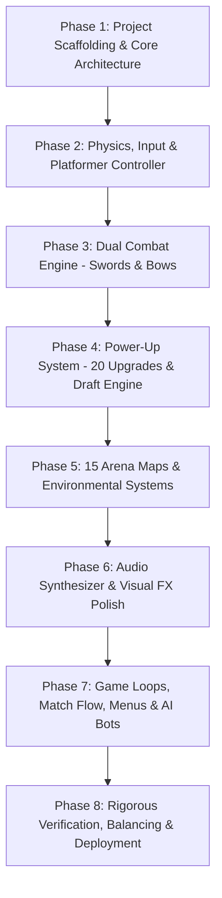

# Swords & Arrows: Platform Battle Game - Master Phase Guide

Welcome to the development and architecture phase guide for **Swords & Arrows**, a fast-paced 2-4 player couch multiplayer platform fighter built for high-stakes competition, seamless weapon switching, deep comeback mechanics, and rich tactical variety across 15 unique battlegrounds.

---

## 🎮 Game Concept Overview

- **Core Gameplay**: 2 to 4 players battle in dynamic platform arenas.
- **Weapons**:
  - **Swords**: Melee strikes, combos, dash slashes, and timing-based parries (can deflect arrows!).
  - **Bows & Arrows**: Ranged trajectory combat, charged piercing shots, arrow retrieval, and mid-air arrow clashing.
  - **Instant Switch**: Toggle between Sword and Bow at any millisecond with a dedicated switch button.
- **Match Format**: Rounds system where matches are played until a player reaches **3 wins** (First to 3).
- **Comeback / Draft Mechanic**: At the end of each round, the **loser(s)** draft 1 power-up from a random choice of 3 cards drawn from a pool of **20 unique power-ups** (10 Sword Perks, 10 Bow Perks). Power-ups stack between rounds.
- **Arenas**: **15 distinct, beautifully styled platform maps** (+ 1 Random Rotation mode) featuring unique interactive terrain, hazards, drop-through ledges, moving elements, and environmental physics.
- **Controls**: Full Gamepad API support (up to 4 controllers) + flexible multi-player keyboard split layouts + intelligent AI bots for any player slot.

---

## 🗺️ Master Phase Roadmap

---

### Phase 1: Project Scaffolding & Core Architecture
- **Objective**: Establish a modern, zero-overhead TypeScript + Vite + Canvas 2D development environment with deterministic fixed-timestep game loop.
- **Key Deliverables**:
  1. `package.json`, `tsconfig.json`, `vite.config.ts`, `index.html`.
  2. Canvas viewport manager with auto-scaling, high-DPI support, and responsive 16:9 letterboxing.
  3. Deterministic 60fps Game Loop (`GameLoop.ts`) with fixed physics tick and interpolated rendering.
  4. Input Abstraction Layer (`InputManager.ts`):
     - HTML5 Gamepad API listener supporting up to 4 simultaneous gamepads with deadzones.
     - Keyboard multi-player key mapping manager (P1, P2, P3, P4 customizable layouts).
     - Unified virtual controller interface for both Humans and AI.

---

### Phase 2: Physics, Input & Platformer Controller
- **Objective**: Build snappy, responsive 2D platformer movement inspired by classic precision platformers and arena fighters (TowerFall, Celeste, Smash Bros).
- **Key Deliverables**:
  1. `AABB` physics collision system supporting:
     - Solid terrain blocks.
     - One-way drop-through platforms (`Down + Jump`).
     - Slopes and bouncy pads.
     - Wall sliding and wall jumping.
  2. Feel & Responsiveness polish:
     - Variable jump height (tap vs hold).
     - Coyote time (5-6 frames after walking off edges).
     - Jump buffering (input remembered before landing).
     - Fast-falling when pressing Down in air.
     - Directional dash with brief invulnerability frames (i-frames).

---

### Phase 3: Dual Combat Engine (Swords & Bows)
- **Objective**: Implement the core weapon switching mechanic and high-intensity melee/ranged combat interactions.
- **Key Deliverables**:
  1. **Weapon Switching Mechanism**:
     - Instant switch button with zero lag, triggering a stance-change animation and HUD indicator.
  2. **Sword Mechanics**:
     - 3-hit ground slash combo and aerial spin slash.
     - Dash strike (forward lunge attacking through foes).
     - **Parry Shield**: Precise timing deflects incoming arrows back at their shooter and stuns melee attackers.
     - Aerial down-thrust (pogo bounce off enemies and bouncy surfaces).
  3. **Bow & Arrow Mechanics**:
     - 8-directional aiming or analog 360-degree aiming with predictive trajectory indicator.
     - Draw charging: quick tap for short arc lob; hold to charge flat, high-velocity piercing shot.
     - Quiver system: Limited arrows that stick into walls/platforms and can be retrieved by walking over them (or regenerate slowly).
     - Mid-air arrow collisions (arrows can clash and cancel or deflect).
  4. **Combat Resolution**:
     - Hitboxes & hurtboxes with priority rules.
     - Hit-stop (freeze frames for 50-80ms on impactful hits).
     - Directional knockback and screen shake.

---

### Phase 4: Power-Up System (20 Upgrades & Loser Draft Engine)
- **Objective**: Implement all 20 unique power-ups (10 Sword, 10 Bow) and the end-of-round comeback draft screen.
- **The 10 Sword Power-Ups**:
  1. **Vorpal Dash**: Dash travels 50% further, phases through enemies, and leaves a slicing shadow trail.
  2. **Sword Beam**: Slashes fire a crescent energy shockwave across the arena.
  3. **Aegis Mastery**: Doubles parry active window; parried arrows gain 2x velocity and explosive power.
  4. **Cyclone Whirlwind**: Spin attack creates a vortex that draws enemies inward and deals rapid multi-hits.
  5. **Vampiric Edge**: Scoring a kill or hit restores a shield point and grants a temporary speed surge.
  6. **Titan Cleaver**: Increases sword size by 70%, deals massive knockback, and breaks through parries.
  7. **Blink Strike**: Melee attack button can be double-tapped to teleport instantly behind a targeted foe.
  8. **Flame Brand**: Sword slashes ignite ground platforms, leaving burning fire patches that damage enemies.
  9. **Thunder Rapier**: Successful hits call down a localized lightning strike from above.
  10. **Blade Flurry**: Attack cooldown reduced by 50%, enabling ultra-fast combo chains.

- **The 10 Bow Power-Ups**:
  1. **Triple Volley**: Fires a spread of 3 arrows in a shotgun arc.
  2. **Seeker Arrows**: Arrows subtly home in on the closest opponent while airborne.
  3. **Explosive Payload**: Arrows explode on contact with terrain or players, creating AOE blast damage.
  4. **Railgun Piercer**: Arrows have zero gravity drop, travel at extreme speed, and pierce terrain.
  5. **Ricochet Trickshot**: Arrows bounce up to 3 times off solid surfaces, gaining speed per bounce.
  6. **Frostbite Quiver**: Arrows freeze targets briefly and leave slippery ice patches on platforms.
  7. **Grapple Arrow**: Arrow embeds in surfaces and pulls the archer rapidly toward the hit location.
  8. **Skyfall Barrage**: Firing straight up summons a rain of 5 arrows falling over the target area.
  9. **Infinite Quiver**: Unlimited ammunition and 50% faster draw charge time.
  10. **Split Shrapnel**: Arrows detonate into 3 fragmentation needles upon impact.

- **Loser Draft Engine**:
  - Automatically identifies round loser(s).
  - Rolls 3 random cards from the pool.
  - Interactive UI card draft: selection via keyboard/gamepad with card flip animations and detailed tooltips.
  - Stackable modifiers attached to player entity for subsequent rounds.

---

### Phase 5: 12 Arena Maps & Environmental Systems
- **Objective**: Design and render 12 distinct, high-personality platform arenas with dynamic elements and hazards.
- **The 12 Maps**:
  1. **The Royal Courtyard**: Classic stone battlements, chandeliers, symmetrical drop-through ledges.
  2. **Molten Caverns**: Rising/falling lava hazard at arena bottom, hanging chains, heat distortion.
  3. **Celestial Citadel**: Bouncy cloud pads, low-gravity wind zones, floating marble columns.
  4. **Sunken Ruins**: Flooded bottom pool with water drag and swimming, mossy multi-tier platforms.
  5. **Clockwork Spire**: Rotating cogwheels that shift player footing, steam vent jump pads.
  6. **Neon Cyber-Dojo**: Speed booster acceleration strips, laser barrier doors that cycle on/off.
  7. **Frostpeak Summit**: Slippery ice terrain, falling icicle hazards, gusty wind physics.
  8. **Haunted Crypt**: Crumbling phantom blocks that vanish after being stepped on, spike traps.
  9. **Sky Pirate Galleon**: Rocking galleon deck, crow's nests, cannon recoil accelerators.
  10. **Toxic Catacombs**: Acid floor hazard, screen-wrapping sewer warp pipes (left-to-right wrap!).
  11. **Desert Tomb**: Cascading sand dunes, collapsing sandstone bricks, pressure dart traps.
  12. **Crystalline Sanctuary**: Prismatic gem walls that reflect arrows, anti-gravity crystals.

---

### Phase 6: Audio Synthesizer & Visual FX Polish
- **Objective**: Deliver a sensory experience with juicy feedback, zero external asset dependencies, and procedural audio.
- **Key Deliverables**:
  1. **Web Audio Synthesizer** (`AudioEngine.ts`):
     - Procedurally generated sound effects: Sword swings, clashing parries, arrow whooshes, arrow impacts, explosion booms, card drafts, victory fanfares.
     - Dynamic background music chords/arpeggios tailored to battle intensity.
  2. **Particle & Visual FX System** (`ParticleSystem.ts`):
     - Sword slash trails, spark bursts, blood/confetti splashes, arrow dust puffs, smoke plumes.
     - Dynamic 2D camera with smart zoom/pan tracking all active fighters.
     - Impact freeze-frame (hit-stop), screen shakes, chromatic aberration pulses.

---

### Phase 7: Game Loops, Match Flow, Menus & AI Bots
- **Objective**: Connect all systems into an intuitive game loop supporting 1-4 players with configurable AI bots.
- **Key Deliverables**:
  1. **Menu Flow**:
     - Title Screen & Instructions / Controls guide.
     - Character Select (P1-P4 player cards, color selection, Human/CPU toggle, AI difficulty).
     - Map Selection (Pick any of the 12 maps or select Random Map Rotation).
     - Match HUD (Win counters [target: 3 wins], health/shields, active weapon stance, power-up icons).
     - Victory Podium (celebration, match statistics: kills, parries, arrow hits).
  2. **Smart AI Combat Bot**:
     - Platforming navigation (jumping, ledge grabbing, drop-down).
     - Weapon choice logic (swaps to sword at close range, bow at long range).
     - Aiming and shooting leading arrows toward targets.
     - Timed parrying against incoming attacks.
     - Automated power-up card drafting during draft phase.

---

### Phase 8: Rigorous Verification, Balancing & Deployment
- **Objective**: Thoroughly test all mechanics, verify multi-input support, confirm 12 maps and 20 power-ups function properly, and prepare production build.
- **Checklist**:
  - [ ] Test 2-player, 3-player, and 4-player matches.
  - [ ] Test AI bots in 1P vs 3 CPUs.
  - [ ] Verify instant weapon swap during all movement states (running, jumping, dashing).
  - [ ] Verify all 10 Sword power-ups produce visible gameplay enhancements.
  - [ ] Verify all 10 Bow power-ups produce visible gameplay enhancements.
  - [ ] Verify first-to-3-wins match victory condition and podium celebration.
  - [ ] Verify all 12 maps load, render distinctly, and trigger hazards correctly.
  - [ ] Verify gamepad detection and keyboard control responsiveness.
  - [ ] Validate 60+ FPS performance and smooth camera tracking.
