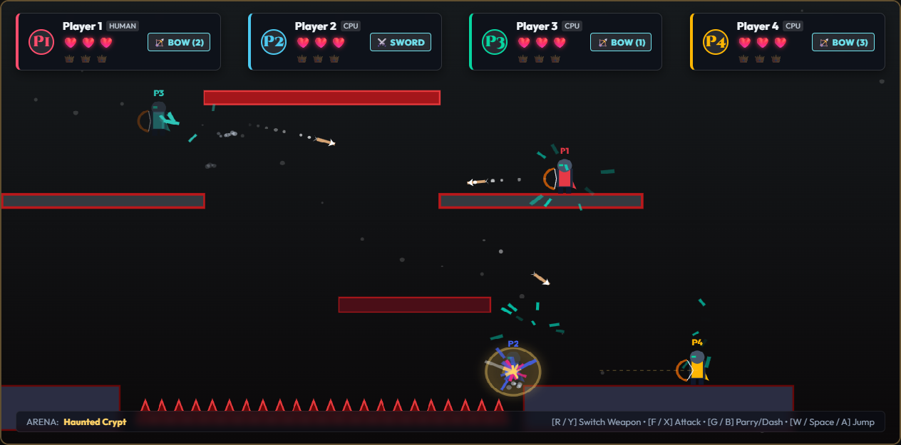
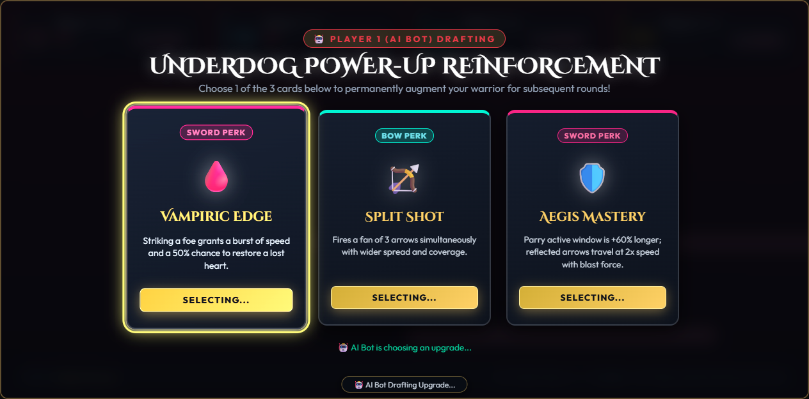
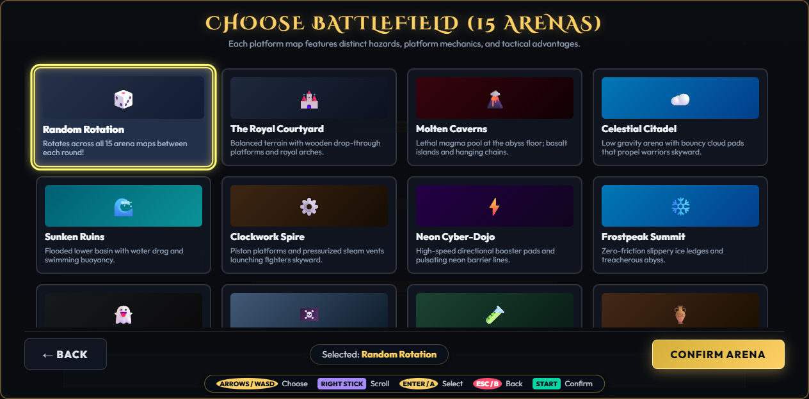
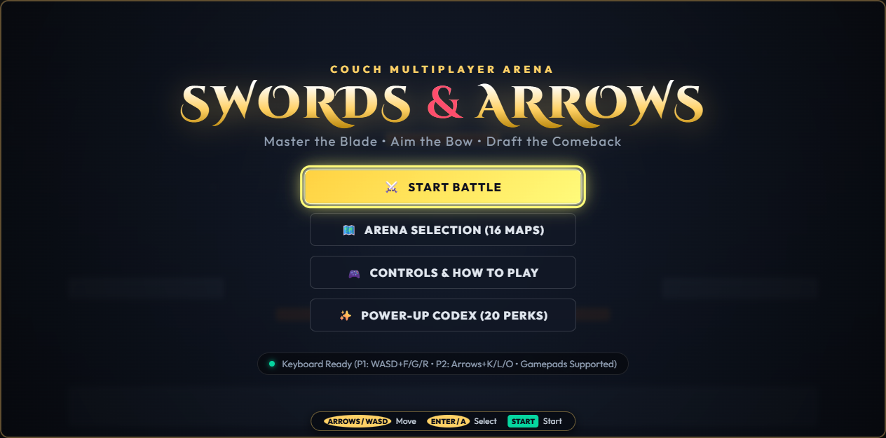

# ⚔️ Swords & Arrows 🏹
### 2–4 Player Couch Multiplayer Platform Battle


[](https://swords-and-arrows.tinyibex.com)


**Swords & Arrows** is a fast-paced, high-stakes 2–4 player couch multiplayer platform battle game built with pure TypeScript, HTML5 Canvas 2D, and Electron. Inspired by classic arena combat games like *TowerFall*, *Smash Bros*, and *Duck Game*, it blends precision platforming, instant weapon toggling, skill-based arrow deflection, and an underdog comeback drafting system.

👉 **Play immediately in your browser at [swords-and-arrows.tinyibex.com](https://swords-and-arrows.tinyibex.com)**!

<p align="center">
  
</p>

---

## 📸 Screenshots

| ⚔️ Fast-Paced 4-Player Combat | 🃏 Underdog Power-Up Drafting |
| :---: | :---: |
|  |  |
| *Mid-air archery, arrow deflection parries, and sword slashes* | *Round losers draft legendary perk cards to mount comebacks* |

| 🏰 15 Unique Tactical Arenas | 👑 Main Menu & Couch Co-op Lobby |
| :---: | :---: |
|  |  |
| *Battlefields with distinct hazards, conveyors, ice, and buoyancy* | *Full Gamepad API controller support & keyboard splits* |

---

## 🌟 Key Features

- **⚔️ Dual Combat System (Swords & Bows)**:
  - **Sword**: Fast melee combos, dash slashes, directional attacks, and timing-based parries that deflect incoming enemy arrows directly back at their shooter.
  - **Bow & Arrows**: Trajectory aiming, charged piercing shots, arrow clashing in mid-air, and physical arrow retrieval from walls and floors.
  - **Instant Weapon Swapping**: Switch between Sword and Bow in a split second at the press of a button.
- **🃏 Underdog Comeback Drafting**:
  - Matches are played to **First to 3 Wins**.
  - At the end of every round, the round loser(s) draft 1 power-up from a choice of 3 cards drawn from a pool of **20 Legendary Upgrades** (10 Sword Perks + 10 Bow Perks). Power-ups stack across rounds to create dynamic comeback opportunities!
- **🏰 15 Unique Tactical Arenas + Random Rotation**:
  - *Royal Courtyard*, *Molten Caverns*, *Celestial Citadel*, *Sunken Ruins*, *Clockwork Spire*, *Neon Cyber-Dojo*, *Frostpeak Summit*, *Haunted Crypt*, *Sky Pirate Galleon*, *Toxic Catacombs*, *Desert Tomb*, *Crystalline Sanctuary*, *Verdant Canopy*, *Stormspire Apex*, and *Astral Void*.
  - Rich environmental mechanics: slippery ice platforms, conveyor belts, water drag and buoyancy, warp pipes, bounce-cap mushrooms, Tesla coils, and low-gravity cosmic rifts.
  - 100% verified platform reachability with precision jump physics across all arenas.
- **🎮 Seamless Couch Co-op & Gamepad Controls**:
  - Native HTML5 Gamepad API supporting up to 4 simultaneous gamepads.
  - Intelligent controller arbitration: Player 1 controls menus and automatically retains Player 1 in gameplay, while additional controllers seamlessly bind to Players 2, 3, and 4.
  - Support for 4-player local keyboard splits.
  - Adaptive AI Bot players (Easy, Medium, Hard) for solo or co-op play.
- **💻 Desktop Binaries & Web App**:
  - Runs natively in any modern web browser.
  - Pre-built binary packages for Windows (`.exe` installer & portable), macOS (`.dmg` & `.zip`), and Linux (`.AppImage` & `.deb`) are automatically built via GitHub Actions and published to [GitHub Releases](https://github.com/bferg314/swords-and-arrows/releases).

> **🍎 macOS Installation Note (Gatekeeper Quarantine)**:  
> Because Swords & Arrows is an independent open-source project without a paid Apple Developer certificate, macOS Gatekeeper quarantines internet downloads and may show *“Swords and Arrows is damaged and can't be opened.”*  
> **To launch on Mac (Apple Silicon or Intel)**:
> 1. Drag **`Swords and Arrows.app`** into your `/Applications` folder.
> 2. Open **Terminal** and run:
>    ```bash
>    xattr -cr /Applications/"Swords and Arrows.app"
>    ```
>    *(Or right-click the app in Finder ➔ select **Open** ➔ click **Open**, or go to **System Settings ➔ Privacy & Security** and click **Open Anyway**).*

---

## 🎮 Controls Guide

### Gamepad Controls (Xbox / PlayStation / Generic)
| Action | Button |
| :--- | :--- |
| **Move / Aim** | Left Stick / D-Pad |
| **Jump** | **A** / Cross (Hold for higher jump) |
| **Drop Through Platform** | **Down + Jump** |
| **Sword Attack / Release Arrow** | **X** / Square |
| **Parry / Aim Bow** | **B** / Circle |
| **Swap Weapon (Sword ⇄ Bow)** | **Y** / Triangle |
| **Dash** | **LT** / **RT** / Left or Right Bumper |
| **Pause Menu** | **Start** / Options |

### Keyboard Controls (Local Multiplayer Splits)
| Action | Player 1 | Player 2 | Player 3 | Player 4 |
| :--- | :--- | :--- | :--- | :--- |
| **Movement** | `W` `A` `S` `D` | `↑` `←` `↓` `→` | `I` `J` `K` `L` | Numpad `8` `4` `5` `6` |
| **Jump** | `W` / `Space` | `↑` | `I` | Numpad `8` |
| **Attack** | `F` | `K` | `U` | Numpad `1` |
| **Parry / Aim** | `G` | `L` | `O` | Numpad `2` |
| **Swap Weapon** | `R` | `O` | `P` | Numpad `3` |
| **Dash** | `Left Shift` | `Right Shift` | `Y` | Numpad `0` |

---

## 🃏 20 Legendary Power-Ups

| Weapon | Power-Up | Effect |
| :--- | :--- | :--- |
| **Sword** | **Vampiric Edge** | Slaying an opponent restores 1 missing heart. |
| **Sword** | **Blade Beam** | Swinging at full health unleashes an energetic crescent blade projectile. |
| **Sword** | **Titan Cleave** | Sword strikes deal +1 damage, slicing clean through light attacks. |
| **Sword** | **Shadow Step** | Dash gains complete invulnerability and teleports through players. |
| **Sword** | **Cyclone Blade** | Spin attacks create a vortex pulling nearby foes into sword range. |
| **Sword** | **Riposte Master** | Parry window extended by 50% with doubled deflection velocity. |
| **Sword** | **Thunder Dash** | Dashing through enemies electrocutes and briefly stuns them. |
| **Sword** | **Executioner** | Attacks against opponents with only 1 heart deal instant lethal damage. |
| **Sword** | **Shield Breaker** | Sword strikes stagger shielding opponents and disable parrying. |
| **Sword** | **Berserker Rage** | At 1 heart remaining, move 30% faster and attack at double speed. |
| **Bow** | **Split Shot** | Fires a volley of 3 arrows in an arc simultaneously. |
| **Bow** | **Piercing Rail** | Arrows pierce through all enemies, terrain, and shields. |
| **Bow** | **Homing Seeker** | Arrows subtly curve in mid-air toward the nearest opposing player. |
| **Bow** | **Bouncing Volley** | Arrows ricochet up to 3 times off platforms and walls before landing. |
| **Bow** | **Explosive Tip** | Arrows detonate on impact, creating a blast radius that launches opponents. |
| **Bow** | **Frost Quiver** | Arrows slow hit enemies by 50% and disable their dash for 3 seconds. |
| **Bow** | **Quick Draw** | Bow charge time reduced by 60% with instant maximum projectile speed. |
| **Bow** | **Infinity Quiver** | Arrows automatically replenish over time without needing retrieval. |
| **Bow** | **Poison Barbs** | Arrows inflict corrosive damage over time. |
| **Bow** | **Overcharge Ballista** | Full-charge shots unleash a massive ballista bolt that knocks back foes. |

---

## 🚀 Getting Started

### Prerequisites
- [Node.js](https://nodejs.org/) (version 18+ recommended)
- [npm](https://www.npmjs.com/)

### Installation
```bash
# Clone the repository
git clone https://github.com/bferg314/swords-and-arrows.git

# Navigate to the project directory
cd swords-and-arrows

# Install dependencies
npm install
```

### Development
```bash
# Launch the local development server (Vite with Hot Module Replacement)
npm run dev
```
Open [http://localhost:5173](http://localhost:5173) in your browser.

### Building & Deploying for Web
```bash
# Build optimized web assets
npm run build

# Preview production build locally
npm run preview

# Deploy to Cloudflare Workers (swords-and-arrows.tinyibex.com)
npm run deploy:worker
```

### Desktop App (Electron)
```bash
# Run desktop version locally in Electron
npm run electron:dev

# Package Windows binaries (.exe installer and portable)
npm run dist:win

# Package macOS binaries (.dmg and .zip)
npm run dist:mac

# Package Linux binaries (.AppImage and .deb)
npm run dist:linux
```

---

## 🛠️ Tech Stack

- **Language**: TypeScript 5.7
- **Bundler & Server**: Vite 6.2
- **Graphics & Engine**: HTML5 Canvas 2D with fixed-timestep physics loop (deterministic 60 FPS)
- **Audio**: Web Audio API Procedural Synthesizer (zero external audio file dependencies)
- **Desktop Framework**: Electron 44 with electron-builder
- **Web Hosting**: Cloudflare Workers with Static Assets & Custom Domain
- **CI/CD**: GitHub Actions (Desktop binaries for Windows, macOS, Linux + automated Cloudflare Workers web deployment)

---

## 📄 License

MIT License — Feel free to use, modify, and distribute for personal and educational projects!
